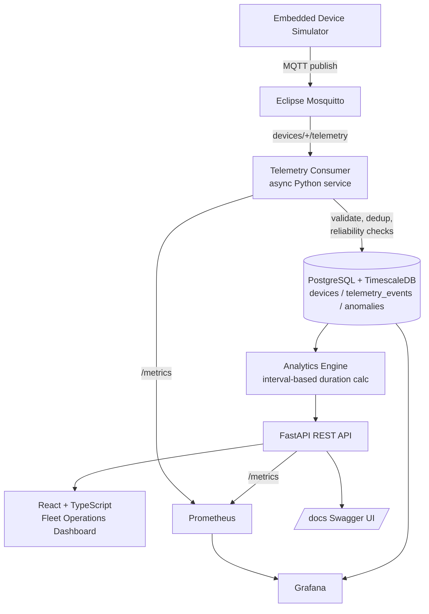
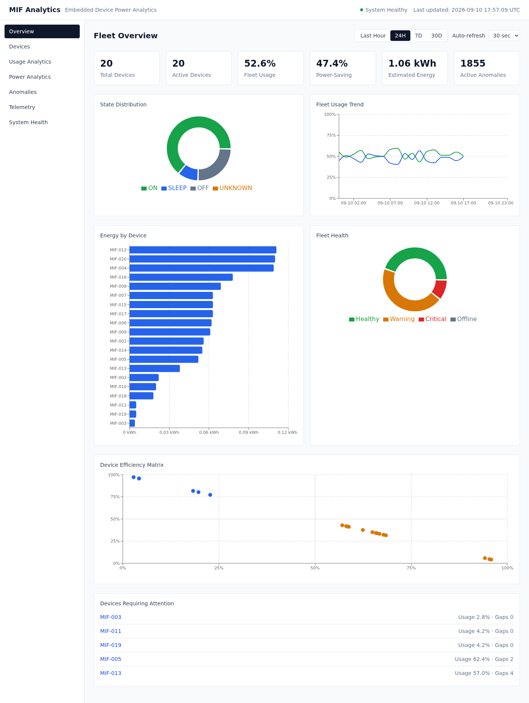
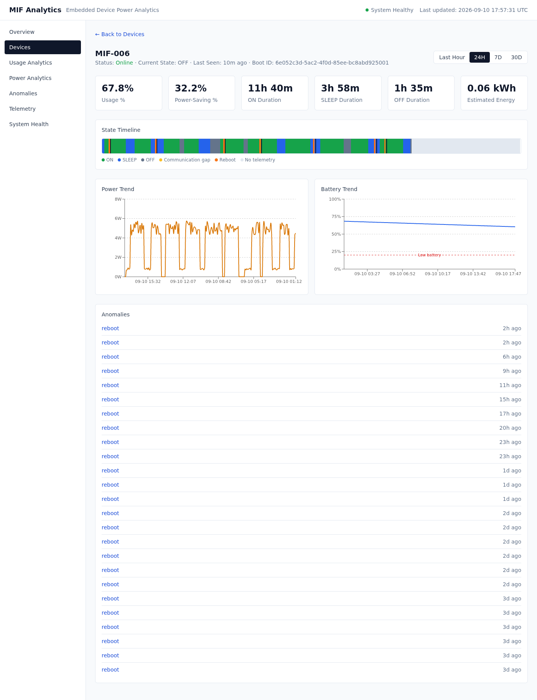
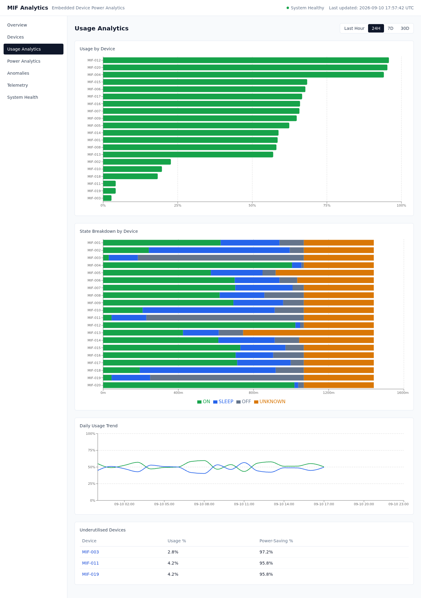
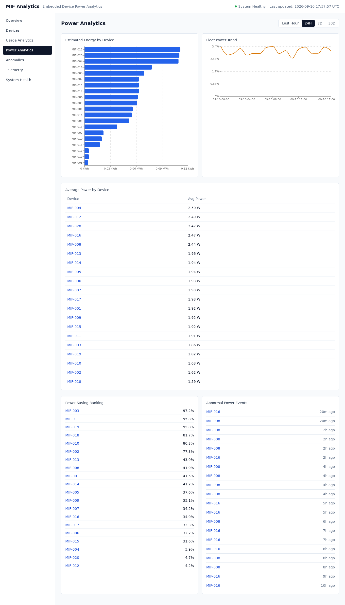
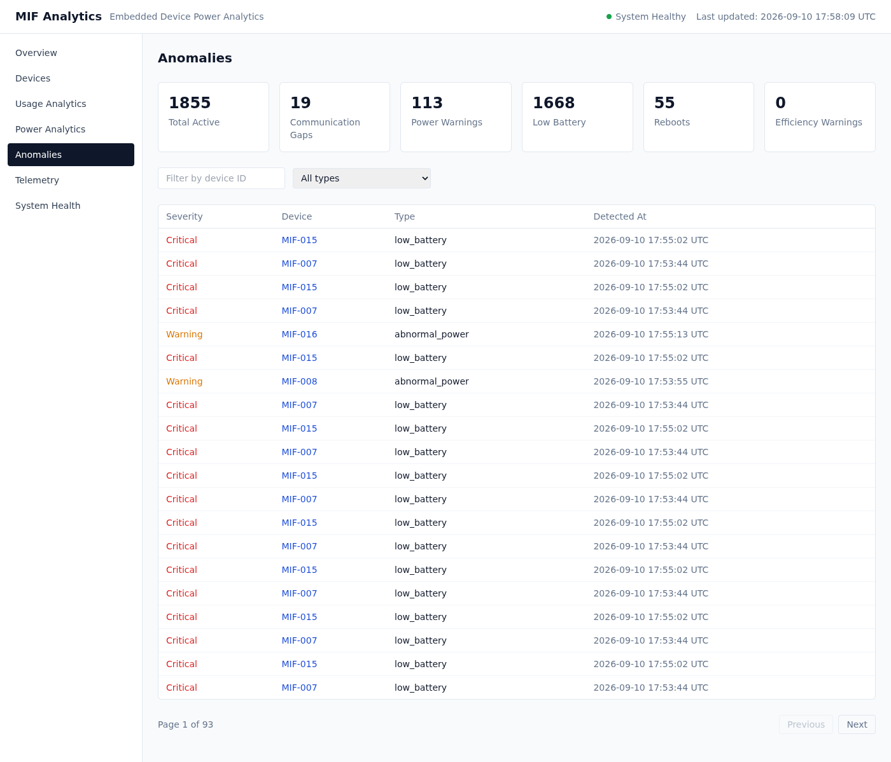
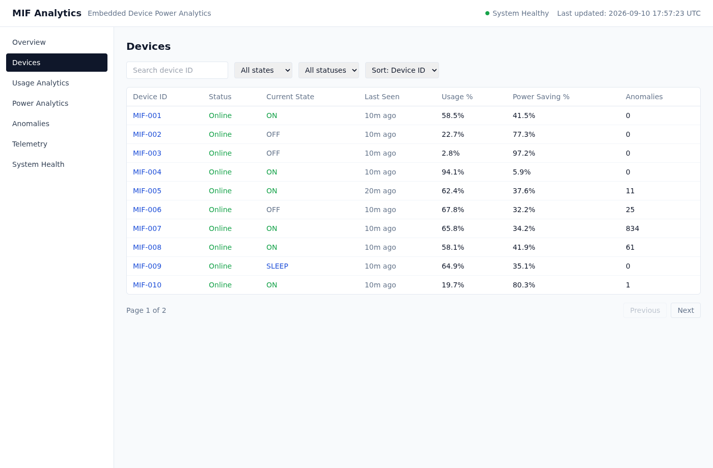

# Embedded Device Usage & Power Analytics

> [!IMPORTANT]
> This repository is publicly viewable for educational, portfolio,
> demonstration, and evaluation purposes. It is proprietary software and
> is not released under an open-source license. Reuse, redistribution,
> modification, derivative works, and commercial use require prior written
> permission from the copyright owner.

A Machine-in-Field (MIF) telemetry analytics platform for embedded/IoT device
fleets: MQTT ingestion, TimescaleDB time-series storage, interval-based usage
and power analytics, deterministic anomaly detection, and a custom React
operations dashboard — backed by a realistic multi-device simulator.

## Overview

Embedded devices in the field (smart plugs, gateways, sensors, industrial
controllers, etc.) periodically report a coarse power state — `ON`, `SLEEP`,
`OFF` — along with battery and instantaneous power draw. On their own, those
messages are just data points. The useful question is operational: *how much
of the day is this fleet actually active, which devices are wasting power,
which ones are going dark, and which ones just rebooted?*

This project answers that with a realistic ingestion pipeline that treats
field data the way it actually arrives — duplicated, delayed, out of order,
occasionally malformed, punctuated by reboots and silent gaps — and turns it
into interval-based duration analytics rather than naive message counting,
surfaced through both a REST API and a purpose-built operations dashboard.

## Core Features

- **MQTT ingestion** from an arbitrary number of devices publishing to
  `devices/{device_id}/telemetry`, consumed by a standalone async Python
  service, independent of the API's request lifecycle.
- **Schema validation & normalisation** (Pydantic v2): UUID message IDs,
  timezone-aware timestamps normalised to UTC, a closed `ON/SLEEP/OFF` state
  enum, bounded battery/power ranges.
- **TimescaleDB time-series storage**: `telemetry_events` is a hypertable;
  raw telemetry is the single authoritative source, plus a continuous
  aggregate for ingestion-rate rollups.
- **Field-data reliability handling**: dedup by `message_id`, out-of-order-safe
  analytics, communication-gap detection, `boot_id`-based reboot/session
  detection, and rejection of malformed timestamps/states/battery/power.
- **Interval-based usage analytics**: ON/SLEEP/OFF/UNKNOWN duration, usage %,
  power-saving %, correct splitting across midnight/week/month boundaries.
- **Power & energy analytics**: average power per state and an estimated kWh
  figure, computed only where `power_watts` was actually observed.
- **Deterministic anomaly detection**: rarely-used, excessive continuous ON,
  poor power-saving, communication gaps, reboots, low battery, abnormal power
  — every threshold centralised in configuration, every severity rule-based.
- **Fleet-level analytics**: state distribution, health distribution,
  usage/power trends, highest/lowest usage devices, device efficiency matrix.
- **FastAPI REST API** with real, non-fabricated system health checks.
- **React + TypeScript operations dashboard**: fleet overview, device table,
  per-device state timeline, usage/power analytics, anomaly dashboard,
  telemetry explorer, system health.
- **Prometheus metrics** for ingestion volume, validation outcomes, dedup,
  ordering, gaps, reboots, and processing errors.
- **Grafana** for infrastructure/observability, auto-provisioned on startup.
- **Multi-device MQTT simulator** with 8 behavioural profiles, including one
  that deliberately misbehaves (duplicates/delays/gaps).
- **Automated tests**: 85 backend tests (pytest, against real TimescaleDB)
  and 15 frontend tests (Vitest + React Testing Library).
- **Docker Compose** runs the whole stack — backend, frontend, broker,
  database, and observability — with one command.
- **GitHub Actions CI** for both backend and frontend.

## Architecture



## Data Flow

```
Embedded Device --(MQTT publish)--> Mosquitto --(subscribe devices/+/telemetry)--> Telemetry Consumer
  --> parse/validate --> dedup (message_id) --> reliability checks (gap/reboot/order)
  --> TimescaleDB (raw telemetry_events, devices, anomalies)
  --> Analytics Engine (interval-based, on read) --> FastAPI --> React Dashboard / Swagger clients

Prometheus --> Grafana   (infrastructure/observability, separate from the product dashboard)
```

The consumer and the API are separate OS processes/containers. The consumer
never blocks on API request handling, and the API never depends on MQTT being
reachable — it only reads from TimescaleDB.

## Telemetry Schema

```json
{
  "message_id": "a1111111-0000-4000-8000-000000000001",
  "device_id": "MIF-001",
  "timestamp": "2026-09-10T10:30:00Z",
  "state": "ON",
  "battery_percent": 82.5,
  "power_watts": 4.7,
  "boot_id": "boot-session-id"
}
```

| Field             | Required | Notes                                                        |
|--------------------|----------|--------------------------------------------------------------|
| `message_id`       | yes      | UUID; the dedup key                                           |
| `device_id`        | yes      | 1-64 chars, `[A-Za-z0-9_-]`; new IDs work with zero config    |
| `timestamp`        | yes      | ISO 8601, **must** carry a timezone; normalised to UTC        |
| `state`            | yes      | one of `ON`, `SLEEP`, `OFF`                                    |
| `battery_percent`  | no       | `0-100`                                                       |
| `power_watts`      | no       | `>= 0`                                                        |
| `boot_id`          | no       | opaque string; a change marks a new device session/reboot     |

The server additionally stamps `ingested_at` (arrival time) — kept separate
from `time` (the device's own event timestamp) precisely so ingestion delay
or reordering can never corrupt duration analytics.

## Reliability Strategy

- **Duplicates** — `INSERT ... ON CONFLICT DO NOTHING` on
  `(device_id, message_id, time)`; a replayed message changes nothing
  downstream.
- **Delayed / out-of-order messages** — analytics always sort by the
  device-reported `time`, never by arrival order.
- **Malformed messages** — invalid JSON, an unrecognised topic shape, or a
  schema violation is rejected with a specific reason label and never raises
  past the pipeline — one bad message, or one bad device, never interrupts
  ingestion for anyone else.
- **Missing telemetry** — never assumed to mean the device stayed ON; time
  with no telemetry is classified `UNKNOWN`, excluded from usage/power-saving
  percentages.
- **Communication gaps** — if two consecutive events for a device are more
  than `GAP_THRESHOLD_MINUTES` (default 30) apart, that interval is classified
  `UNKNOWN`, not attributed to whatever state preceded it. A
  `communication_gap` anomaly is recorded with the gap duration.
- **Reboots / session changes** — a change in `boot_id` between two
  consecutive events marks a new device session. The interval spanning that
  boundary is classified `UNKNOWN` (uninterrupted operation is never assumed
  across a reboot), and a `reboot` anomaly is recorded.
- **Unknown duration** — always excluded from the usage %/power-saving %
  denominator, and always visible on the device timeline rather than hidden.

## Analytics Methodology

Telemetry events represent **state transitions**, not equally-weighted
samples — duration comes from the elapsed wall-clock time between two
consecutive device-timestamped events. **Message counts are never used as a
substitute for operating-state duration.**

For a device's events sorted by `time`, the interval `[event[i], event[i+1])`
is attributed to `event[i].state` for its duration, *unless* a reboot
(`boot_id` changed) or a communication gap (interval longer than the
threshold) occurred in that interval — those are classified `UNKNOWN`
instead. Each interval is clipped to the requested reporting window before
being attributed, which is exactly what makes an interval that crosses
midnight/a week boundary/a month boundary split correctly between the two
adjacent periods:

```
23:50 ON  ->  00:20 SLEEP (next day)
  contributes 10 minutes to Day 1's ON total
  contributes 20 minutes to Day 2's ON total
```

Time before the first known event, or after the last known event, is
`UNKNOWN` — duration is **never manufactured** past what telemetry actually
reported.

See [`app/analytics/state_duration.py`](app/analytics/state_duration.py) and
[`app/analytics/timeline.py`](app/analytics/timeline.py) for the full,
precisely-commented implementation.

## Formulas

```
classified_seconds = on_seconds + sleep_seconds + off_seconds   (excludes UNKNOWN)

usage_percent         = on_seconds / classified_seconds * 100
power_saving_percent  = (sleep_seconds + off_seconds) / classified_seconds * 100

estimated_energy_kWh  = avg_power_watts_for_state * duration_hours / 1000   (summed per state)
```

`usage_percent`/`power_saving_percent` are `null` when `classified_seconds`
is zero (e.g. a device with only gaps/unknown time in the window) rather than
dividing by zero. Energy is only estimated for states where at least one
`power_watts` sample was observed — `battery_percent` is a charge level, not
an energy measurement, and is never substituted in.

## Anomaly Rules

All thresholds live in `app/core/config.py` (`Settings`), overridable via
environment variables. Severity (`INFO`/`WARNING`/`CRITICAL`) is derived
deterministically in [`app/analytics/severity.py`](app/analytics/severity.py).

| Anomaly                | Default rule                                  |
|-------------------------|------------------------------------------------|
| Rarely used             | `usage_percent < 10%`                          |
| Excessive continuous ON | longest uninterrupted ON streak `> 8 hours`    |
| Poor power-saving       | `power_saving_percent < 20%`                   |
| Communication gap       | inter-event gap `> 30 minutes`                 |
| Low battery             | `battery_percent < 20%`                        |
| Reboot                  | `boot_id` changed between consecutive events   |
| Abnormal power          | `power_watts > 2.5x` the device's own recent average for that state |

## Frontend Dashboard

The custom frontend is the primary product interface — device operations,
analytics, and investigation. Grafana is infrastructure/observability. The
frontend never embeds Grafana; it's a purpose-built console:

| Page | Answers |
|---|---|
| **Overview** (`/`) | Fleet KPIs, state distribution, usage trend, energy by device, fleet health, device efficiency matrix, devices requiring attention |
| **Devices** (`/devices`) | Searchable/sortable/filterable device table with pagination |
| **Device Detail** (`/devices/:id`) | KPIs, state timeline (ON/SLEEP/OFF/UNKNOWN/reboot markers), power trend, battery trend, anomalies |
| **Usage Analytics** (`/analytics/usage`) | Usage by device, state breakdown by device, daily usage trend, underutilised devices |
| **Power Analytics** (`/analytics/power`) | Energy by device, fleet power trend, average power ranking, power-saving ranking, abnormal power events |
| **Anomalies** (`/anomalies`) | Summary KPIs, filterable/paginated anomaly table with severity |
| **Telemetry** (`/telemetry`) | Backend-paginated raw telemetry explorer with device/state filters |
| **System Health** (`/system`) | Real reachability status for every service — never fabricated |

### Screenshots

Captured from the actual running stack, populated with real simulator data
(20 devices, 8 behavioural profiles, 72 hours of backfilled telemetry).

**Fleet Overview**


**Device Detail — State Timeline**


**Usage Analytics**


**Power Analytics**


**Anomaly Dashboard**


**Devices**


## Grafana vs. the Custom Frontend

```
Custom frontend  = product / device operations (this is what you demo)
Grafana          = infrastructure / observability (ingestion rate, valid vs
                    rejected messages, processing errors, service health)
```

Grafana is auto-provisioned with the **Embedded Device Fleet Overview**
dashboard — no manual setup required.

## Technology Stack

| Choice                        | Why                                                                 |
|--------------------------------|----------------------------------------------------------------------|
| Python 3.12 + asyncio          | Async I/O suits an MQTT consumer and an API serving concurrent reads |
| Eclipse Mosquitto (MQTT)       | Lightweight, standard IoT transport; decouples devices from the backend |
| aiomqtt                        | Maintained asyncio-native MQTT client                                |
| FastAPI + Pydantic v2          | Typed request/response models, free OpenAPI/Swagger docs             |
| PostgreSQL + TimescaleDB       | Real time-series workload (hypertables, continuous aggregates)       |
| SQLAlchemy 2 (async) + asyncpg | Typed, parameterised DB access; no raw string SQL for user data      |
| Alembic                        | Versioned schema migrations                                          |
| React + TypeScript + Vite      | Typed, fast-iterating SPA for the operations dashboard                |
| Recharts                       | Composable charting that covers donuts/bars/lines/scatter without a heavy footprint |
| Tailwind CSS                   | Utility-first styling without hand-rolled CSS sprawl                  |
| Prometheus + Grafana           | Standard, self-hostable observability stack                          |
| Docker Compose                 | Reproducible multi-service local stack, one command                  |

Deliberately **not** used: Kafka, Kubernetes, Redis/Celery, Next.js, Redux,
cloud-managed services — this fleet size and workload doesn't need them, and
adding them would be complexity without a corresponding benefit.

## Windows Setup

1. Install [Docker Desktop for Windows](https://www.docker.com/products/docker-desktop/)
   (WSL2 backend), Python 3.12+, and Node.js 20+.
2. Clone/copy this repository, then from the project root:

```powershell
Copy-Item .env.example .env
```

3. (Optional, for running backend tools outside Docker):

```powershell
python -m venv .venv
.\.venv\Scripts\Activate.ps1
pip install -r requirements-dev.txt
```

## Docker Startup

```bash
docker compose -p embedded_device_power_analytics up --build
```

This starts Mosquitto, TimescaleDB, the API, the telemetry consumer, the
frontend, Prometheus, and Grafana. The API container runs `alembic upgrade
head` before starting Uvicorn, so the schema (including the hypertable) is
created automatically on first boot.

## Frontend

```
http://localhost:3000
```

Served by nginx from a production build; API calls go through nginx's
same-origin `/api` proxy to the backend, so no CORS configuration is needed
in normal Docker use.

## Swagger / OpenAPI

```
http://localhost:8000/docs
```

## Grafana

```
http://localhost:3001
```

(Note: the frontend uses port 3000; Grafana is mapped to 3001 to avoid a
collision.) Anonymous viewer access is enabled for local development
(`admin`/`admin` for full access).

## Simulator

The simulator is a Compose profile (not started by default, since it's a
traffic generator, not a service):

```bash
docker compose -p embedded_device_power_analytics --profile simulator up simulator
```

Or run it directly against the broker for more control:

```bash
python -m simulator.run --devices 20 --interval 2 --mqtt-host localhost --mqtt-port 1883
```

Add `--seed 42` for a fully deterministic run, or generate rich historical
data instantly instead of waiting for real time to pass:

```bash
python -m simulator.run --devices 20 --backfill-hours 72 --mqtt-host localhost
```

Each device is assigned one of 8 profiles round-robin: `normal`, `efficient`,
`underutilised`, `inefficient`, `unreliable` (duplicates/delays/gaps),
`rebooting`, `low_battery`, `abnormal_power`.

## API

| Endpoint                                | Notes                                       |
|-------------------------------------------|----------------------------------------------|
| `GET /health`, `GET /ready`               | liveness / readiness (DB connectivity)       |
| `GET /devices`, `GET /devices/{id}`       | device registry                              |
| `GET /devices/{id}/summary`               | quick daily snapshot                         |
| `GET /devices/{id}/analytics`             | `?period=hourly\|daily\|weekly\|monthly` or `?start=&end=` |
| `GET /devices/{id}/anomalies`             | per-device anomalies                          |
| `GET /devices/{id}/timeline`              | interval segments for the state timeline      |
| `GET /fleet/summary`, `/overview`, `/states`, `/usage`, `/power` | fleet-wide analytics       |
| `GET /anomalies`, `/anomalies/summary`    | fleet-wide anomalies, paginated + filterable  |
| `GET /telemetry`                          | backend-paginated raw telemetry explorer      |
| `GET /system/health`                      | real per-service reachability status          |
| `GET /metrics`                            | Prometheus exposition format                  |

## Testing

### Backend

```bash
pip install -r requirements-dev.txt

# Unit tests only (no infrastructure required)
pytest tests/unit -v

# Full suite, including integration tests against a real TimescaleDB
docker compose -p embedded_device_power_analytics up -d timescaledb
pytest -v

ruff check .
```

> Integration tests truncate their tables after each test. Don't run them
> against a database you want to keep demo data in — re-run the simulator
> afterward if you do.

### Frontend

```bash
cd frontend
npm install
npm run lint
npm test
npm run build
```

## Cleanup

```powershell
.\scripts\cleanup.ps1
```

```bash
./scripts/cleanup.sh
```

Both scripts: run `docker compose -p embedded_device_power_analytics down
--volumes --remove-orphans`, then verify and remove only resources carrying
the `com.docker.compose.project=embedded_device_power_analytics` label,
remove this project's own built images if unused, and individually check
each third-party base image against every remaining container before
removing it — a base image still referenced by any other container on the
machine is always preserved. **No global `docker system/image/volume prune`
is ever used.**

## Scalability

- New device IDs work with zero code changes — the device registry is
  populated lazily from telemetry, never hardcoded.
- MQTT decouples device count from backend load in the way a fleet of
  hundreds (rather than thousands) of devices needs.
- TimescaleDB hypertables handle the time-series access pattern (recent-data
  writes, time-range reads) better than a plain relational table would.
- Ingestion (consumer), reads (API), and presentation (frontend) are already
  separate processes, so each can be scaled independently.
- This is a **local, single-broker, single-consumer, single-database**
  reference implementation — it demonstrates the architecture, not
  internet-scale production infrastructure. A larger deployment would look at
  a managed/clustered broker, multiple consumer replicas with topic
  partitioning, and a managed TimescaleDB/Postgres instance.

## Future Improvements

- MQTT TLS + per-device authentication (mutual TLS or username/password ACLs)
- Real physical embedded devices instead of the simulator
- OTA firmware update integration
- Outbound alert delivery (email/Slack/webhook) for anomalies
- Horizontally scaled consumers with topic-based partitioning
- Managed cloud deployment (managed Postgres/Timescale, managed MQTT broker)

## Contributions

Unsolicited contributions are not currently accepted. See
[CONTRIBUTING.md](CONTRIBUTING.md).

## License and Usage Rights

Copyright © 2026 Gautham. All rights reserved.

This project is source-visible for educational, portfolio, demonstration,
and evaluation purposes. It is not open-source software.

Viewing and studying the source for personal, non-commercial educational
purposes is permitted. Copying, modification, redistribution, commercial
use, sublicensing, publication, or creation of derivative works requires
prior written permission.

See the [LICENSE](LICENSE) file for complete terms.
